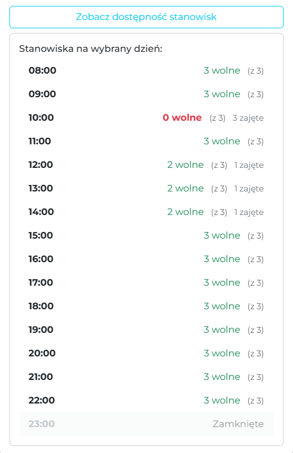
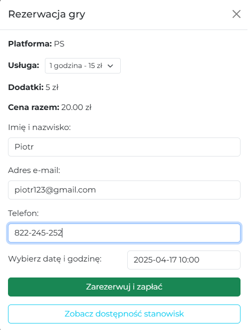

# 🎮 GameHaven – Gaming Club with a Reservation System for PC and Console Stations

**GameHaven** is a simple yet functional reservation system designed for game lounges. It allows users to check availability and book gaming stations by the hour. Supported platforms include **PC**, **PlayStation**, and **Xbox**.

## 🔧 Features

- ✅ Select date and platform (PC, PS, Xbox)
- ⏱ View real-time hourly availability (8:00–23:00)
- 📊 Book with custom duration (1h, 3h, etc.)
- 🔐 Backend prevents overbooking with real-time checks
- 🌐 Clean frontend with dynamic availability list and loading animation
- 🗃 MongoDB database (accurate reservation records)

## 💡 Technology

- **Frontend:** HTML, CSS (Bootstrap), JavaScript
- **Backend:** Node.js + Express
- **Database:** MongoDB (Mongoose)
- **Data format:** ISO 8601 (`YYYY-MM-DDTHH:mm:ss.sssZ`)
- **API:** `/api/reservations` to make reservations, `/api/occupancy` to check occupancy

## 🧠 How It Works

1. User selects a date and platform
2. The system fetches current occupancy data from the backend
3. The list of hours shows:
   - ✅ Number of free slots
   - ❌ Fully booked hours
   - 🕓 Unavailable slots (e.g. 23:00, closing time)

## 📦 Installation

```bash
git clone https://github.com/ThePioter18/GameHaven.git
cd GameHaven
npm install
npm start
```

## 🧪 Running the Project

After `npm start` you should see:

🚀 Server running on port 5000
✅ Successfully connected to MongoDB

### Frontend

Open index.html from the GameHaven/ folder

Best experience: use Live Server (e.g. in VS Code)
Or open your browser and go to: http://localhost:5000

### 📁 Project Structure

```plaintext
GameHaven/
├── assets/           # Images
├── css/              # Compiled CSS styles
├── js/               # Frontend JavaScript files
├── models/           # Mongoose schemas
├── routes/           # Express API endpoints
├── sass/             # SCSS source files
├── .env.example      # Environment variables (e.g., PORT, MONGO_URI)
├── config.js         # MongoDB connection logic using mongoose and dotenv
├── index.html        # Main frontend HTML file
├── server.js         # Backend entry point – starts Express server and connects to MongoDB
└── README.md
```

🖼️ Screenshots

<p align="center">  <br/> <em>Availability preview – shows hourly availability per platform</em> </p> <p align="center">  <br/> <em>Booking form – allows users to reserve a time slot</em> </p>
